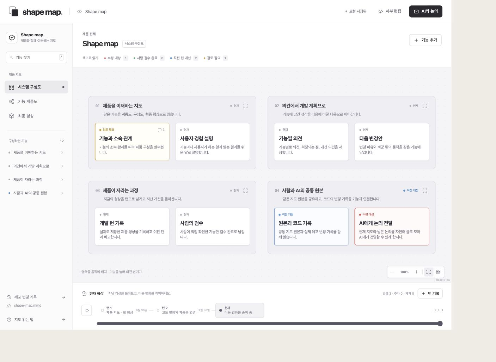
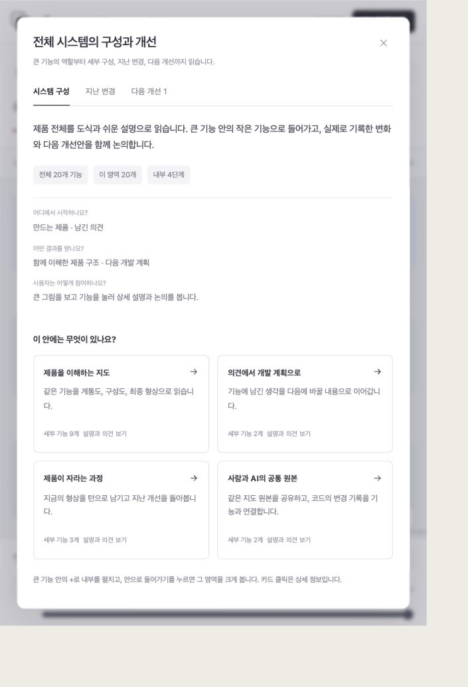
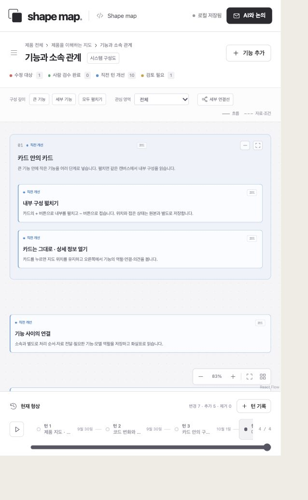

# Shape map

**Understand the product you are building. Shape its next turn together.**

Shape map is an open source, local application for people who want to understand
software without reading all of its code. It turns a product into a navigable
diagram: what each feature does, where it belongs, what changed, and what to
improve next. The interface is Korean-first.



## One product, three ways to read it

- **Function hierarchy** — follow a feature from its parent into its parts.
- **System composition** — see the features grouped into product areas.
- **Product shape** — read each feature through its user experience and result.

Composition cards can contain more cards at any depth. Expand them in place;
click a card to read its details. Recorded arrows show processing, data transfer,
dependencies, and model roles. Connections can be inspected and edited in the
feature's **연결** tab. Reading selectors come from the map itself: video formats,
model roles, and custom logic can be described without hardcoding a product's
rules into the application. Selections explain the saved design and do not
change the running product's configuration.

Connections use separate ports and routing lanes, reserving space for their
explanations. Routes update when cards move or unfold. **지도 화면에 맞추기**
includes the arrows and their labels as well as the cards.

**전체 구성** returns from a focused feature to the complete system. The scope
bar distinguishes the whole product from the area currently on screen.
**구성·변경 설명** explains that area's role, its nested parts, recorded changes,
and saved improvement plans. Every card also has a **변경 기록** tab with actual
before/after text, composition, and connections—even while it has a red proposal.
Connected source files lead to the corresponding Git changes.





The infinite canvas uses a quiet monochrome palette. Color carries meaning:

| Color | Meaning | Source |
| --- | --- | --- |
| Red | Next change target | A saved proposal or explicit plan |
| Green | Human reviewed | An explicit confirmation of the current feature |
| Blue | Improved in the previous turn | A difference between recorded turns |
| Yellow | Needs attention | An unresolved concern |

Review is attached to the feature's content. Changing that content invalidates
the review. Turns contain real saved snapshots; the application does not invent
development history or approvals.

## Start locally

Requires Node.js 22.12 or newer and Git for repository history.

```sh
git clone https://github.com/minutimes/shape-map.git
cd shape-map
npm ci
npm run dev
```

Open **http://127.0.0.1:4317**. The included map explains Shape map itself.
To keep a built version running in the background:

```sh
npm run build
npm run start:local
npm run status:local
```

## Work with an AI

1. Click a feature. Leave a note, a concern, or a proposed change.
2. Click a card to open its attached editor, write a memo or proposal, and save it.
   Use **AI에 전달** for that feature and its parts, or **AI와 논의** for the whole
   map, to copy or save a readable discussion brief.
3. Give the brief and map to your coding agent. The agent can edit the shared
   Mermaid file or use the revision-checked local API.
4. Watch the open canvas update. Inspect the implementation, confirm features
   you have reviewed, and record a turn with the reason for the changes.

This release works with the AI you already use. The discussion brief is an
actual export of your map and unresolved comments. Model calls, email delivery,
and automatic execution are not connected in this release.

Feature comments and proposals are persisted alongside the diagram. Drafts stay
in the browser while you type. If a person and an AI edit the same feature,
both versions are shown before saving; unrelated edits can be preserved.

## Bring your own map and repository

Keep your map in a workspace and point the local service at it:

```sh
FINAL_SHAPE_MAP_DATA_ROOT=/path/to/product-workspace \
FINAL_SHAPE_MAP_PATH=product.mmd \
SHAPE_MAP_REPOSITORY_ROOT=/path/to/product-repository \
npm run dev
```

The map must use the supported Mermaid subset. The main file is authoritative
for structure, connections, reading conditions, descriptions, proposals,
comments, and turns. Its `.view.json`
companion stores canvas position, viewport, and fold state only. Each feature
can list related source paths; the repository history panel connects actual
changed files to those features. A code commit is distinct from a product turn
and from human review.

There is no paid service or API key requirement. The server listens on loopback,
reads only the configured map workspace, and rejects out-of-workspace symlinks.

## Development

```sh
npm test
npm run build
```

The detailed hierarchy editor is available through **세부 편집** or `?editor=1`.
It retains inline editing, keyboard shortcuts, branch reparenting, undo/redo,
optional execution metadata, and reference sections.

See [the map format](docs/FORMAT.md), [the local API](docs/API.md),
[the Shape map contract](docs/SHAPE-MAP.md), and [contributing](CONTRIBUTING.md).

## Current boundaries

Shape map records a shared product description. It does not automatically infer
the entire architecture from arbitrary source code. An AI can author or update
that description using the real repository as evidence. Recorded turns replay
the map; they do not check out old code or execute it. This local release supports
up to 100 turns, 1 MiB per turn, and 16 MiB per canonical source file.

Licensed under the [MIT License](LICENSE).
