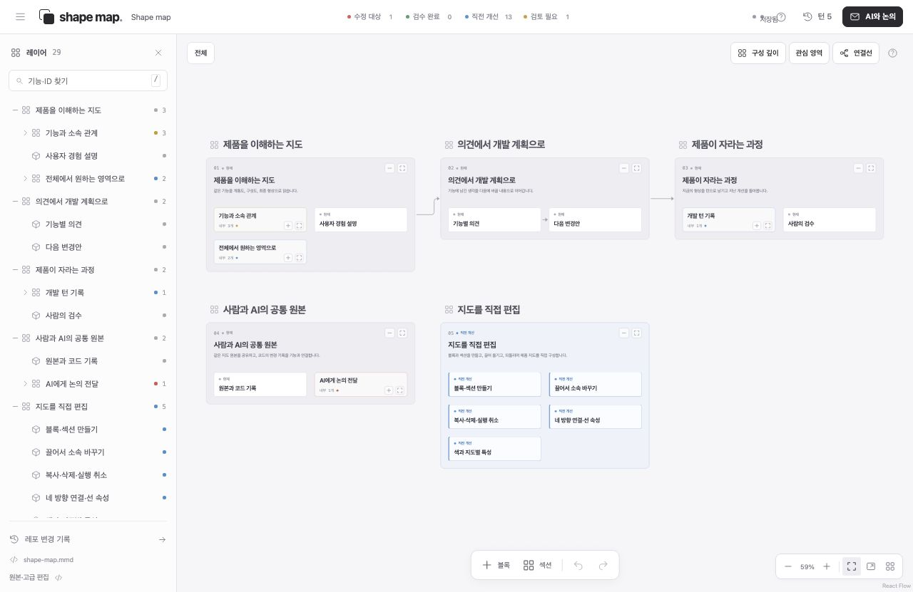

# Shape map

**Understand the product you are building. Shape its next turn together.**

Shape map is an open source, local application for people who want to understand
software without reading all of its code. It turns a product into a navigable
diagram: what each feature does, where it belongs, what changed, and what to
improve next. The interface is Korean-first.



## One canvas, a nested product

Function hierarchy, system composition, and product shape are read together.
The left **레이어** panel mirrors the actual feature tree: fold a branch, find a
feature by name or ID, and select it to locate it on the canvas. Hide the
panel to use the full canvas. Top-level section titles stay readable when zoomed
out. The toolbar is compact; recorded turns open only when requested. Narrow
windows adapt the controls while retaining the same canvas arrangement and positions.

Cards can contain more cards at any depth. Click a card to expand or fold its
contents in place. The clicked card stays at the same screen position and zoom.
Expanding a card makes room among its siblings and neighboring sections. Folding
it again brings the neighboring sections back. Manually moved cards remember
their row, column, and spacing as nearby cards change size. These relationships
survive undo, redo, and reopening the map; automatic spacing does not overwrite
the authored positions.
Use its pencil to read and edit its role, notes, proposal, attributes, connections,
and recorded changes. A leaf click selects it. Its stable ID has a copy
button. **구성·변경 설명** provides a plain-language explanation of the current
scope. Connected source files lead to actual Git changes.

Right-click blank space to create a block or section, or use the bottom tools.
Right-click a block to rename, change attributes, copy, duplicate, or delete it.
Drag a block into a section to change its saved parent in place. The drop previews
the new parent and position together while saving; it does not refit the camera.
Selected sections have
resize handles. Drops clear sibling cards; containers grow to hold their contents.
Pull a connection from any of four sides and drop anywhere on a target card.
The deepest visible card under the pointer takes priority; section background
connects to the section. A highlighted outline previews the target. Exact ports
still work when a particular side matters. Click the line or label to edit the
explanation, condition, or relationship. **연결선** controls detail and model links.
The preview and drop share the same target coordinates at every zoom and pan.
Releasing over blank canvas cancels the connection.

| Shortcut | Action |
| --- | --- |
| Ctrl/⌘ + wheel | Zoom the canvas; plain wheel pans |
| Ctrl/⌘ + C / V / D | Copy / paste / duplicate selected branches |
| Delete / Backspace | Delete selected blocks and their contents |
| Ctrl/⌘ + Z / Shift + Z | Undo / redo content, folds, depth, movement, size, and section placement |
| Shift drag or Ctrl/⌘ click | Select multiple blocks |
| / | Open feature search |

Text fields retain their normal editing shortcuts. Undo history lasts for the
current session; a semantic edit by another client clears it to protect that
client's work. Deletion undo restores IDs, children, connections, and attributes.
Copies get fresh IDs and do not inherit human review. Turn records are immutable.

Reading selectors and attributes come from the map itself. They can describe
video formats, model roles, and custom logic without hardcoded product rules.
An optional map-authored `group` puts related selectors in one menu. Filters
explain saved design; they do not change the running product's configuration.

The infinite canvas uses a quiet monochrome palette. Color carries meaning:

| Color | Meaning | Source |
| --- | --- | --- |
| Red | Next change target | A saved proposal or explicit plan |
| Green | Human reviewed | An explicit confirmation of the current feature |
| Blue | Improved in the previous turn | A difference between recorded turns |
| Yellow | Needs attention | An unresolved concern |

Review is attached to the feature's content. Changing that content invalidates
the review. Turns contain real saved snapshots; the application does not invent
development history or approvals.

## Start locally

Requires Node.js 22.12 or newer and Git for repository history.

```sh
git clone https://github.com/minutimes/shape-map.git
cd shape-map
npm ci
npm run dev
```

Open **http://127.0.0.1:4317**. The included map explains Shape map itself.
To keep a built version running in the background:

```sh
npm run build
npm run start:local
npm run status:local
```

## Work with an AI

1. Leave notes and proposed changes on the relevant feature IDs.
2. Choose **AI에 전달** for that feature and its parts, or **AI와 논의** for the map.
   Write the problem, purpose, and observable success criteria. The export refers
   to the canonical file and includes changed plans and new unresolved notes;
   it does not repeat the whole map or dictate implementation steps.
3. Give this request and the map to your coding agent. Use the **기획문답**
   (`decision-interview`) skill to clarify only intent that cannot be found in
   the evidence. Confirm a final proposal; after approval, the agent implements
   and verifies it. A [portable facilitation skill](skills/shape-map-facilitation/SKILL.md)
   is included for agents without the user's installed skill.
4. Inspect the implementation, confirm features you have actually reviewed, and
   record a turn. The service never treats exporting a request as implementation.

The request starts unapproved. The optional approval checkbox is enabled only
with a problem and success criteria, and resets when the request changes. Source
references remain complete; excerpts of saved map notes are bounded. User-written
problem, purpose, and criteria are preserved in full. This release exports to
the AI you already use; provider calls and email delivery are separate future work.

Feature comments and proposals are persisted alongside the diagram. Drafts stay
in the browser while you type. If a person and an AI edit the same feature,
both versions are shown before saving; unrelated edits can be preserved.

## Bring your own map and repository

Keep your map in a workspace and point the local service at it:

```sh
FINAL_SHAPE_MAP_DATA_ROOT=/path/to/product-workspace \
FINAL_SHAPE_MAP_PATH=product.mmd \
SHAPE_MAP_REPOSITORY_ROOT=/path/to/product-repository \
npm run dev
```

The map must use the supported Mermaid subset. The main file is authoritative
for structure, connections, reading conditions, descriptions, proposals,
comments, and turns. Its `.view.json`
companion stores canvas position, section size, viewport, and fold state only. Each feature
can list related source paths; the repository history panel connects actual
changed files to those features. A code commit is distinct from a product turn
and from human review.

There is no paid service or API key requirement. The server listens on loopback,
reads only the configured map workspace, and rejects out-of-workspace symlinks.

## Open product repositories

Point Shape map at a folder that holds your product repositories:

```sh
SHAPE_MAP_WORKSPACE_ROOT=/path/to/products npm run dev
```

The home screen lists each Git repository in that folder, and its worktrees
with their branch. Opening one shows every map in its `docs/maps/` folder in
tabs: **기능 계통도**, **유저 플로우**, **시스템 플로우**, and **기타 그림**. Edits
are written straight back to that repository's `.mmd` files; canvas state stays
in Shape map's own `.state/` folder. A file Shape map cannot edit is drawn
read-only with the reason and the line to fix, and becomes editable once fixed.
Maps added or changed on disk appear without reloading. The address keeps the
open project and map, so links and back/forward work. Check maps without the
app using `npm run map -- check path/to/docs/maps`.

## Development

```sh
npm test
npm run build
```

The detailed hierarchy editor is available through **원본·고급 편집** or `?editor=1`.
It retains inline editing, keyboard shortcuts, branch reparenting, undo/redo,
optional execution metadata, and reference sections.

See [the map format](docs/FORMAT.md), [the local API](docs/API.md),
[the Shape map contract](docs/SHAPE-MAP.md), and [contributing](CONTRIBUTING.md).

## Current boundaries

Shape map records a shared product description. It does not automatically infer
the entire architecture from arbitrary source code. An AI can author or update
that description using the real repository as evidence. Recorded turns replay
the map; they do not check out old code or execute it. This local release supports
up to 100 turns, 1 MiB per turn, and 16 MiB per canonical source file.

Licensed under the [MIT License](LICENSE).
