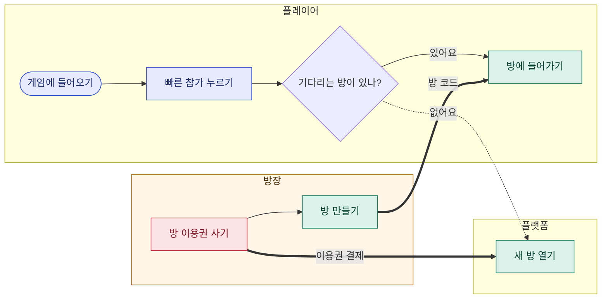

# Supported Mermaid contract (v1)

`maps/*.mmd` is the single authority for graph meaning and node presentation.
The editor deliberately supports a small Mermaid `flowchart` subset so every visual
operation has an honest text round trip. A product repository can keep several
maps of different kinds; see [Project maps](#project-maps) and
[Flow maps](#flow-maps).

## Authoritative syntax

- One `flowchart LR` declaration.
- Stable node identifiers matching `[A-Za-z][A-Za-z0-9_-]*`.
- Rectangles: `id["label"]`; rounded nodes: `id(["label"])`.
- Hierarchy only: `parent --> child`. Each non-root node has exactly one parent;
  cycles are invalid. Cross-feature relationships use `sm-link` metadata and are
  never inferred from spatial placement.
- Category presentation: `classDef name fill:#RRGGBB,stroke:#RRGGBB,color:#RRGGBB,stroke-width:Npx`
  and `class id1,id2 name`.
- Explicit legend copy: `%% mlc-legend: category|Korean label|description`.
- Optional per-node sizing presentation:
  - content fit (the default; omitted from source): `%% mlc-node-layout: id|fit`
  - fixed width with visible wrapped content: `%% mlc-node-layout: id|wrap|WIDTH`
  - fixed width and height with clipped content: `%% mlc-node-layout: id|fixed|WIDTH|HEIGHT`
  - width is an integer from 168–720; height is an integer from 72–480.
- Optional task semantics: `%% mlc-task: id|JSON`, where `JSON` follows this shape:
  ```json
  {
    "logic": "optional text",
    "inputs": "optional text",
    "outputs": "optional text",
    "ui": "optional text",
    "condition": "optional text",
    "executor": {
      "kind": "code|perception|llm|jev|human",
      "model": "optional descriptive design value",
      "effort": "optional descriptive design value for llm only",
      "language": "optional en"
    }
  }
  ```
  Empty optional strings are omitted. Each task text field is limited to 4,000
  characters, `model` to 160, `effort` to 80, and the complete JSON comment to
  64 KiB. A `jev` executor defaults to `"language":"en"`; other languages are
  rejected. These values describe intended execution only and do not invoke a
  model provider.
- Optional proposal semantics: `%% mlc-proposal: id|JSON`. A proposal accepts
  the same `logic`, `inputs`, `outputs`, `ui`, `condition`, and atomic `executor`
  fields as a task, plus optional `reason` text. `reason` has the same 4,000
  character limit. An empty proposal `{}` is meaningful and is preserved so a
  newly opened proposal can exist before its first field is filled. Proposal
  metadata is descriptive and does not change graph or view behavior.
- Optional child workflow semantics: `%% mlc-workflow: id|{"mode":"sequence"}`.
  The supported modes are `group`, `sequence`, `parallel`, and `conditional`.
  An absent workflow means `group`; writers preserve absence instead of adding
  redundant metadata.
- Optional reference-area semantics: `%% mlc-section: id|reference`. The tagged
  node starts a reference subtree; the UI treats that node and all descendants
  as reference material instead of normal system-flow items. Descendants keep
  their own stable IDs, parents, task data, proposals, workflows, and
  presentation. The single graph root cannot be tagged as a reference section.
- Optional map-level editor settings: one `%% mlc-settings: JSON` comment, where
  JSON has exactly this shape:
  ```json
  { "optionalFields": ["executor", "model", "effort", "condition", "workflow"] }
  ```
  `optionalFields` is required and may be empty. Every entry must be unique and
  drawn from that exact enum. The setting controls which optional authoring
  features the UI exposes for this map; it does not remove values already stored
  in task, proposal, or workflow metadata. An empty array deliberately hides all
  five optional features while preserving their data. If the comment is absent,
  readers and writers preserve that absence instead of materializing defaults.
- Optional map header: one `%% sm-map: JSON` comment whose `kind` is `features`
  (see [Project maps](#project-maps)). An absent header stays absent.
- The marker `%% mlc-format: 1` is required.

Product metadata (`sm-block`, `sm-turn`, `sm-link`, and `sm-lens`) is documented
in [the Shape map contract](SHAPE-MAP.md). It lives in this same `.mmd` source;
Mermaid treats these lines as comments. Parent arrows remain an unambiguous tree.

Label text is JSON-quoted by the writer, so Korean, spaces, and punctuation survive.
Task, proposal, and workflow comments split at the first delimiter after the node ID, so `|`
inside valid JSON strings survives the round trip.
IDs never change during rename, move, shape, category, or card-size edits.
Sibling order is the order of node declarations among nodes with the same parent;
there is no separate child reference list.

## Non-authoritative view state

`maps/<name>.view.json` may store node positions, collapsed IDs, and viewport.
The product canvas also stores optional `shape.sizes` keyed by feature ID with
`{width,height}` (168×72 to 30000×30000). Coordinates inside a section are relative
to that section. A `null` entry in a shape position or size patch removes the
override for undo; deleted feature entries are filtered. Sizes are spatial view
state and never replace the canonical Mermaid hierarchy or feature meaning.

Shape positions are placement preferences. When an expanded card or section
would overlap a sibling, the canvas gives it room in reading order and grows its
container. This derived spacing does not overwrite saved positions. Folding or
undoing the expansion restores the arrangement from those same preferences.

Optional `shape.anchors` remembers manual placement relative to sibling cards:
`x: {id, edge: "left" | "right", offset}` aligns a column or follows a left
neighbor; `y: {ids, edge: "top" | "bottom", offset}` follows a row's top or
greatest bottom. Offsets use the same section-relative coordinates as positions.
References must be siblings and cannot contain cycles. Missing or stale references
are filtered on read. An anchor patch is merged by feature ID; `null` removes it.
Anchors participate in spatial undo and redo and never alter Mermaid hierarchy.

The view may also contain independent workflow navigation state:

```json
{
  "workflow": {
    "collapsedIds": ["planning"],
    "viewport": { "x": 0, "y": 0, "zoom": 1 }
  }
}
```

The workflow key remains absent in legacy views until workflow navigation is
written. Its `collapsedIds` and `viewport` fields are independently optional: a
first viewport write does not create an empty collapse list, and a first collapse
write does not create a viewport. Invalid or deleted node IDs are filtered from
both collapse lists.
Deleting it never changes the map meaning; the editor rebuilds a layout. External
semantic edits retain view entries for still-existing IDs.

## Safety boundary

Unknown Mermaid statements, duplicate IDs, duplicate section/settings metadata,
multiple parents, cycles, missing categories, unknown metadata properties,
invalid section/settings enum values, invalid metadata types or sizes, or invalid
Mermaid syntax are rejected. Unsupported source is never rewritten in a
way that could lose semantic metadata. The server keeps showing the last valid
snapshot and never overwrites the invalid file. A revision mismatch is returned
as a recoverable conflict, except for the field-guarded content patch described
in the API contract. That operation compares every field with the latest source
before it writes; a mismatch is returned as a recoverable field conflict.

## Project maps

A product repository keeps its maps in `docs/maps/` at the repository root.
Shape map reads every `*.mmd` file directly inside that folder. Subfolders,
names that start with `.`, and other files such as `README.md` are ignored, so
the folder can also hold notes for people.

Each map names its kind in one header comment:

```text
%% sm-map: {"kind":"system-flow","title":"방 플로우","description":"방을 만들고 들어가고 다시 하는 흐름"}
```

| Field | Rule |
| --- | --- |
| `kind` | Required: `features`, `user-flow`, or `system-flow`. |
| `title` | Optional, 1–80 characters. The map's name in Shape map. |
| `description` | Optional, up to 400 characters. One line shown with the title. |

| Kind | Tab | What it shows | Contract |
| --- | --- | --- | --- |
| `features` | 기능 계통도 | What the product can do, as a feature tree | v1, above |
| `user-flow` | 유저 플로우 | How each kind of participant moves through the product | [Flow maps](#flow-maps) |
| `system-flow` | 시스템 플로우 | How the system runs: rooms, leagues, payments, servers | [Flow maps](#flow-maps) |

Unknown properties are rejected, and a file has at most one header. The header
may be on any line; Shape map writes it directly after the declaration lines.
Without a header, a file in the v1 format above is a `features` map, so existing
maps remain valid unchanged, and writers preserve the absence. Every other map
needs a header. The default title is the root label of a `features` map and the
file name without `.mmd` for a flow map.

Shape map shows one tab per kind, in this order: 기능 계통도, 유저 플로우,
시스템 플로우, then 기타 그림. Within a tab, maps are ordered by file name, so a
numeric prefix such as `01-rooms.mmd` sets their order.

A file that Shape map cannot edit is still listed: another Mermaid diagram type,
a kind from a later version, or a file with an invalid line. It appears read-only
in its declared tab, or under 기타 그림, with the reason and the line number.
Shape map never rewrites such a file. Once the file is fixed, it becomes editable
without a restart.

Shape map writes only the `.mmd` files that a person edits or creates. Canvas
state for project maps stays in Shape map's local state directory, never in the
project.

### Creating a map

A map created from the app starts from a small template, written by the same
canonical writer that edits use. It passes `npm run map -- check`, and
`npm run map -- format` leaves it unchanged. The header holds the kind, the
title, and the description when one was given.

| Kind | Starter content |
| --- | --- |
| `features` | One root feature, `root(["title"])`, in one category `feature` (기능, "제품이 하는 일"). A `"` in the title becomes `”` in the root label only. |
| `user-flow` | One lane `lane-1["사용자"]` with one start step `step-1(["시작"])`. |
| `system-flow` | One lane `lane-1["서비스"]` with one start step `step-1(["시작"])`. |

The file name is `NN-slug.mmd`. `NN` is one more than the highest leading number
already used in `docs/maps` (by any file), with at least two digits, so the new
map comes last in its tab among numbered files. `slug` is the ASCII letters and
digits of the title in lower case, joined by `-` and at most 40 characters; a
title without any, such as a Korean title, uses the kind (`features`,
`user-flow`, or `system-flow`). If a name is taken, including one that differs
only in letter case, the next number is used. Renaming a map later changes only
its header; the file name stays.

The file is written to a temporary name starting with `.` in `docs/maps` and
then published under its final name only if that name is still free, so the map
appears complete or not at all and an existing file is never replaced.
`docs/` and `docs/maps/` are created when missing; they must resolve inside
the project.

## Flow maps

User flows and system flows share one Mermaid flowchart subset.

A **user flow** (유저 플로우) shows how each kind of participant moves through a
product: what they do and in what order, which way they choose, where they hand
something to another participant, and what they exchange. Participants are not
only paying customers. A lane can be a consumer, a provider, a data provider, an
operator, or an automated system.

A **system flow** (시스템 플로우) shows how the system runs: how a room or a
league is created, started, repeated, and closed, what happens when something
fails, and which part does what. Its lanes are areas or components, such as a
public server, a room server, or payments. A system flow may have no lanes.



### Statements

Each statement is on its own line; blank lines are allowed.

- **Declaration.** Exactly one `flowchart LR`, `flowchart TB`, or `flowchart TD`,
  and exactly one `%% sm-map:` header whose kind is `user-flow` or `system-flow`.
  Shape map always lays lanes out as rows. The direction only changes how other
  Mermaid viewers draw the file, and it is kept as written.
- **Lanes.** `subgraph ID["title"]`, the lane's statements, then `end`. In a user
  flow a lane is one kind of participant; in a system flow it is an area or a
  component. Lanes do not nest. A lane may start with `direction LR`, `RL`, `TB`,
  `TD`, or `BT`, which is kept as written. Lanes are shown top to bottom in
  declaration order. A lane may be empty.
- **Steps.** `ID["label"]` is an action, `ID(["label"])` is a start, an end, or a
  milestone, and `ID{"label"}` is a decision. A step declared inside a lane
  belongs to that lane; a step declared outside every lane is shared. Declaration
  order is the reading order wherever arrows do not already set one.
- **Arrows.**
  - `A --> B`: the next step.
  - `A -.-> B`: another way, an optional path, or a return.
  - `A ==> B`: a handoff or exchange between participants or parts, such as
    money, data, content, or an invitation.

  Any arrow may carry a label, as in `A -->|"label"| B`. Arrows may be chained
  between declared IDs, as in `A --> B -->|"label"| C`. Both ends of every arrow
  must be declared steps, not lanes, and must differ. At most one arrow joins the
  same source and target, so that pair identifies the arrow. Arrows keep their
  declaration order. An arrow may appear inside a lane only when both of its ends
  are steps already declared in that lane.
- **Tags (표시).** `classDef NAME fill:#RRGGBB,stroke:#RRGGBB,color:#RRGGBB,stroke-width:Npx`,
  optionally followed by `,stroke-dasharray:N M` with N and M from 1 to 40. A
  dashed tag marks something undecided or something that is not a real step.
  Each tag has exactly one `%% mlc-legend: NAME|label|description`.
  `class ID1,ID2 NAME` puts the tag on steps or lanes, and several `class` lines
  may name the same tag. A step or lane can carry several tags, each at most
  once. Tags describe places, exchanges, sides, or anything else the map needs;
  Shape map shows them as chips and can highlight them. A tag may be defined
  without being used.
- **Descriptions and records.** `%% sm-block: ID|JSON` on a step or lane. A lane
  block has only `summary`. A step block may have `summary`, then the
  collaboration records described in [Flow collaboration](#flow-collaboration):
  `features`, `status`, `review`, and `comments`, written in that order. A note
  about a step belongs in its `summary` rather than in a separate note box.
- **Proposals.** `%% mlc-proposal: STEP_ID|JSON`, at most one per step and never
  on a lane. See [Flow collaboration](#flow-collaboration).
- **Turns.** `%% sm-turn: JSON`, one line per recorded turn, numbered from 1 in
  source order. See [Flow collaboration](#flow-collaboration).

Every other statement is rejected with its line number. This includes `&`, node
declarations inside arrows, links without an arrowhead (`---`, `-.-`), `style`,
`linkStyle`, `click`, other node shapes, and other comments.

### Identifiers and text

- IDs match `[A-Za-z][A-Za-z0-9_-]*` and never change during edits. Lanes and
  steps share one namespace; tag names are separate. Mermaid keywords (`end`,
  `graph`, `flowchart`, `subgraph`, `class`, `classDef`, `click`, `style`,
  `linkStyle`, and `direction`, in any letter case) cannot be IDs.
- Labels, lane titles, and arrow labels are JSON-quoted text on one line. They
  cannot contain a double quote (`"`), because Mermaid cannot read it; use ‘ ’ or
  “ ” instead. Step labels have 1–200 characters, lane titles 1–80, arrow labels
  up to 120, and summaries up to 4,000. Shape map shows all text as plain text.
- A flow map has at most 50 lanes, 2,000 steps, 4,000 arrows, and 64 tags. A
  source file is at most 16 MiB.

### Canonical text

Shape map writes flow maps in this order: the declaration and header; each lane
with its direction, if any, and its steps; shared steps; arrows, one per line;
`classDef` lines; one `class` line per used tag, listing lanes and then steps in
declaration order; `sm-block` lines for lanes and then steps; `mlc-proposal`
lines in step order; legends; and `sm-turn` lines in turn order. It indents
with two spaces, and four inside a lane. A valid file in another form, such as
chained arrows, arrows inside a lane, or a tag split over several `class` lines,
is accepted as written. The first edit from Shape map rewrites it in canonical
form without changing its meaning. `npm run map -- format PATH` does that rewrite
ahead of time, so later edits change only the lines people change. Invalid flow sources follow the same safety
boundary as v1 maps: they are never rewritten. A file without collaboration
records is written exactly as before: absent records stay absent.

### Flow collaboration

Flow steps carry the same collaboration records as features, in the same
vocabulary as [the Shape map contract](SHAPE-MAP.md). All of them are optional
and live in the flow file itself.

```text
  %% sm-block: reader_search|{"summary":"제목이나 저자로 찾아요.","features":[{"map":"01-features.mmd","id":"search"}],"status":"verified","review":{"at":"2026-10-02T09:00:00.000Z","fingerprint":"<SHA-256>"},"comments":[{"id":"…","body":"결과가 너무 많아요","kind":"concern","author":"사람","createdAt":"2026-10-02T09:01:00.000Z"}]}

  %% mlc-proposal: reader_wait|{"reason":"입고 알림이 늦어요","purpose":"기다리지 않게","logic":"들어오면 바로 알려요","successCriteria":"한 시간 안에 알림이 와요"}

  %% sm-turn: {"id":"…","number":1,"title":"처음 기록","createdAt":"…","revision":"…","lanes":[…],"steps":[…],"arrows":[…],"tags":[…]}
```

| Record | Rule |
| --- | --- |
| `features` | 1–50 explicit links `{ "map", "id" }` to features of the same project. `map` is a file name in `docs/maps/` such as `01-features.mmd`; `id` is a feature ID. Each link appears once. Links are never inferred. A link whose map or feature no longer exists stays valid and is shown as 찾을 수 없는 기능. To remove all links, remove the field. |
| `status` | `neutral`, `planned`, `verified`, or `concern`, as for features. Shape map writes `verified` with a review and removes the field otherwise; an explicit value in the file is kept. |
| `review` | `{ "at", "fingerprint" }`: when a person confirmed the step, and the SHA-256 fingerprint of its content then. |
| `comments` | Up to 1,000 memos `{ id, body, kind, author, createdAt, resolved? }`; `kind` is `note`, `concern`, or `change`. |
| `mlc-proposal` | The next change for the step: optional `reason` (problem), `purpose`, `logic` (desired change), and `successCriteria`, each up to 4,000 characters. `{}` is kept. Other proposal fields of features maps are rejected. |
| `sm-turn` | A recorded turn: `id`, consecutive `number`, `title` (up to 200 characters), optional `summary`, `createdAt`, source `revision`, and a snapshot of `lanes`, `steps`, `arrows`, and `tags` (steps keep their records). At most 100 turns and 1 MiB per turn. |

A step's fingerprint covers its label, shape, lane, tags, summary, proposal,
feature links, and the arrows that start or end at it. Memos and review markers
do not count. A step block line is at most 1 MiB. Unknown fields and records on
lanes are rejected with their line number.
