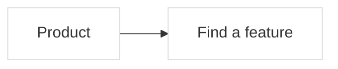

# Shape map contract

The product workspace is the default route. `?editor=1` opens the detailed
hierarchy editor. Both edit the same source and preserve the same feature IDs.

The whole-system view shows the main areas and their immediate internal cards,
folding deeper containers, with the main handoffs. Explicit
area relationships remain visible; **Detailed connections** exposes the smaller
data connections. Entering an area opens deeper nested cards. An explicit focus
link opens that area at a readable scale rather than restoring a different view's
saved camera. A link to the whole-system root restores its saved canvas state,
just like the home route. Reference notes remain in the source but are excluded from product
feature counts and color totals.

## Canonical metadata

The existing `mlc-format: 1` Mermaid subset remains supported. Shape map adds:



`%% sm-block: NODE_ID|JSON` stores optional `summary`, repository-relative `files`,
`status`, `review`, and `comments`. Status is `neutral`, `planned`, `verified`, or
`concern`. Comments include `id`, `body`, `kind` (`note`, `concern`, or `change`),
`author`, `createdAt`, and optional `resolved`. The service generates IDs and dates.

`%% sm-turn: JSON` is an immutable turn with `id`, consecutive `number`, `title`,
optional `summary`, `createdAt`, source `revision`, `nodes`, `categories`, and
optional map `settings`. Snapshots include review/comments without nested history.
Viewing a turn never restores it over the working graph.

`%% sm-link: JSON` records a cross-feature connection:

```json
{"id":"speech_to_render","source":"speech","target":"render","kind":"data","label":"Timed speech","condition":"When the user approves the selection"}
```

`id`, `source`, and `target` are stable identifiers; endpoints must exist and
must differ. `kind` is `flow`, `data`, `dependency`, or `activation`. `label` is
required (up to 180 characters); `condition` is optional (up to 4,000). Connection
cycles are allowed without changing the single-parent hierarchy. Up to 4,000
connections are supported. Optional `sourcePort` and `targetPort` are `left`,
`right`, `top`, or `bottom`; the canvas uses these saved endpoints when visible.
Duplicate IDs and unknown properties are rejected.

`%% sm-lens: JSON` defines a map-authored reading selector:

```json
{"id":"format","label":"Video format","options":[{"id":"spoken","label":"Spoken video","description":"Features used for speech-led editing","roots":["speech","render"],"exclude":[],"custom":["speech"],"pending":[]}]}
```

An optional lens `group` (up to 180 characters) groups related selectors in one
menu without changing their IDs, scope, or intersection semantics. No default
group is written for legacy maps.

An option includes all descendants of its `roots`, subtracts `exclude` branches,
and can mark `custom` branches as specific logic and `pending` branches as planned
or unconnected. Ancestor containers remain readable. Multiple selected lenses
intersect their scopes. Selectors highlight saved design; they never enable a
provider or change execution settings. The product contains no hardcoded video
formats or model names. Up to 20 lenses with 1–32 unique options each are allowed;
each ID list contains at most 2,000 existing features.

Turn snapshots also capture optional `links` and `lenses`. Deleting a subtree
prunes dangling endpoints and option references; hierarchy-editor undo restores
them along with the deleted cards.
Undo merges only references to restored cards and preserves newer unrelated
connections and reading-option text.

## Derived colors

Red proposals take priority. An unresolved concern gives yellow. A verified state
requires a matching content fingerprint. Otherwise blue is a semantic change
between the last two completed turns, only while the live feature still matches
the last recorded turn. The first turn does not invent previous changes.

Fingerprints cover a feature's label, parent, task, proposal, workflow, description,
source paths, immediate child IDs, and incident connections. Comments and review markers do not count
as implementation changes. A change to the feature invalidates its prior review.

## API and AI use

`GET /api/brief` returns `{text,mapPath,revision,targetCount,approved}`. Its optional
`?focus=NODE_ID` limits the brief to a feature and descendants. Global briefs
compare against the last recorded turn and include changed plans, new unresolved
notes, changed fields, and added IDs. A focused brief also includes that branch's
saved intent. The export references the canonical file instead of repeating tasks,
connections, and selectors. At most 12 targets and two memo excerpts per target
are expanded; remaining items stay in the source. Unknown IDs are rejected.

`POST /api/brief` adds optional `focus`, `problem`, `purpose`, `successCriteria`
(strings up to 4,000 characters each), and `approved` (boolean, default false).
Approval requires a nonempty problem and criteria. Human-written request fields
are exported in full. Generating a brief never mutates the map or calls a model.
It directs the agent to use **기획문답 / decision-interview**, clarify ambiguous
intent, agree on a final proposal, and implement after user approval. The portable
[facilitation skill](../skills/shape-map-facilitation/SKILL.md) describes this workflow.

Proposals support optional `purpose` and `successCriteria` alongside `reason`.
These planning fields remain separate from executable task fields; applying a
proposal does not put them into `task` or execute code.

`GET /api/repository` returns
real Git commits and the connected features inferred from their changed paths.
External map workspaces require `SHAPE_MAP_REPOSITORY_ROOT` to connect Git.

All semantic mutations use `POST /api/mutations` with `baseRevision`, `clientId`,
and one `operation`. Additions:

| Operation | Fields |
| --- | --- |
| `setBlock` | `id`, optional `label`, partial `block` (`summary`, `files`, `status`), optional `expectedFingerprint` |
| `addComment` | `id`, `body`, `kind`, `author` |
| `resolveComment` | `id`, `commentId`, optional `resolved` |
| `setProposal` | `id`, `proposal` or `null`, optional `expectedFingerprint` |
| `applyProposal` | `id` |
| `createTurn` | `title`, optional `summary` |
| `upsertLink` | `link` object |
| `removeLink` | connection `id` |
| `setMapLinks` | complete `links` array or `null` |
| `setMapLenses` | complete `lenses` array or `null` |

`addNode` accepts optional block metadata. `renameNode` supports the same optional
fingerprint guard. A stale same-feature form returns HTTP 409 `field_conflict`;
an old source revision returns HTTP 409 `revision_conflict`. Both include a fresh
snapshot. Overview label and block changes are atomic. Comments and proposals
remain intact when updating unrelated description fields.

Applying a proposal updates recorded task fields; it does not implement code.
An AI should inspect and change the actual repository, update the map to match
what was implemented, and record the reason. Human review belongs to the user.

CLI shortcuts:

```sh
npm run map -- brief
npm run map -- comment search "Consider finding by description" --kind change
npm run map -- propose search --reason "Names are too vague" --logic "Search names and descriptions"
npm run map -- turn "Search improvements" --summary "Explain the actual change and validation"
```

They work on a project map through the running server with `--project KEY --map
FILE` (or `SHAPE_MAP_PROJECT` and `SHAPE_MAP_MAP`), so an AI session can work on a
user flow or system flow from the terminal. `FINAL_SHAPE_MAP_URL` selects the
server (default `http://127.0.0.1:4317`). On a flow map, `comment` takes a step
or lane ID, `propose` a step ID, and `brief --focus` a step or lane ID:

```sh
npm run map -- show --project bookshelf --map 02-lending.mmd
npm run map -- comment reader_search "결과가 너무 많아요" --kind concern --project bookshelf --map 02-lending.mmd
npm run map -- propose reader_wait --reason "알림이 늦어요" --logic "들어오면 바로 알려요" --success "한 시간 안에 알림" --project bookshelf --map 02-lending.mmd
npm run map -- turn "알림 흐름 정리" --summary "실제로 바꾼 것과 확인한 방법" --project bookshelf --map 02-lending.mmd
npm run map -- brief --focus reader_wait --problem "알림이 늦어요" --success "한 시간 안에 알림" --project bookshelf --map 02-lending.mmd
```

`brief` also accepts `--purpose` and `--approved` (which needs a problem and
success criteria). There is no command for human review: only a person confirms
it in the app.

The server supplies turn IDs, comment IDs, dates, and review fingerprints. UI
operations cannot inject those values. Source editing remains an explicit
authoring channel; its declarations are descriptions, not verified runtime proof.

## Canvas and durability

`PUT /api/view` accepts `patch.shape` with positions, viewport, fold state, and
`layoutVersion: 3` for horizontal nested composition. Version 2 remains readable
for older clients. Upgrading resets outdated composition positions, viewport,
and folding, preserving legacy editor navigation and all source content.
It is independent of legacy structure/workflow navigation and contains no semantic
data. Dragging a composition area repositions its child cards without reparenting.
Manual placements can also store sibling row and column anchors in the view.
Nearby sections follow expansion and folding while retaining those authored gaps;
placement relationships are saved and restored with spatial undo and redo.
Composition and product views recursively pack cards in ordered horizontal grids.
Dense containers grow to hold their contents; rough branches keep smaller frames.
Sequences retain authored order. Deep branches never squeeze descendants narrower
with each level. The full label remains canonical and accessible; compact tiles
show the name before a descriptive separator when a label is long, with up to
two visible lines. Complete names and authored descriptions appear in the editor.
Card clicks expand or fold parts on the same canvas; leaf clicks select them.
The pencil opens attached details. Folding anchors the clicked card on screen
without changing zoom or fitting the whole diagram. Saved open sizes return on
expansion. Reparent drops preview the new parent and final pointer position
together, then install the saved source and view together. Canvas folds, depth
changes, movement, and resizing share the same undo/redo order as content edits.
Undoing a fold keeps its card anchored. Creating or pasting into a folded parent
records its automatic expansion with the content edit. Camera navigation and
unchanged view choices do not add history entries. Whole-card connection
targets prefer the deepest visible card; section background targets its section.
Four exact ports remain available. The target outline and committed connection
use the same targeting rule. The status text, minimap, and bottom controls each
reserve their own space. The separate focus button enters an area. Connections
between containers attach to their boundaries by default; the detailed-connections control exposes their
saved endpoints. Only an explicit sequence or recorded connection creates a
flow arrow. Function hierarchy is progressive: enter a feature to see its parts.
The diagram retains its horizontal composition on all screen sizes; compact
controls adapt to the available width without rearranging authored cards.
Composition cards do not create floating
title capsules on zoom out. The function hierarchy retains its overview labels.
The canvas can expand within the app for broad diagrams; the fit control includes
all cards, return routes, and labels.
Connection routing reserves parent title bands and handles unequal grid heights.
When a dense diagram has no clear space for an inline explanation, the complete
saved text remains on edge hover and in the connection inspector.

The pencil opens a nonmodal editor attached beside the card's screen position,
with a leader back to the selected card. Panning and zooming move the attachment
without resizing the canvas. The editor switches sides or uses a contained sheet
on small screens. Hidden descendants attach to their nearest visible ancestor.
Escape closes it and restores focus. Existing description, proposal, memo,
history, connection, local-draft, and conflict behavior remains shared. Its AI
action exports the selected feature's saved discussion; unsaved drafts stay local.

The whole-system projection initially folds deeper containers; entering an area
exposes more levels without limiting the source's hierarchy. The scope bar counts
product features and the selected area's descendants, excluding inherited
reference sections. Its whole-system action is available even on deep links.
The area reader shows authored natural-language descriptions, nested parts,
actual recorded turn changes, and saved proposals. It never synthesizes missing
architecture from the code or treats a proposal as completed implementation.
Feature history compares consecutive saved snapshots, independently of a red
proposal or review color, with before/after fields and connection descriptions.
The first turn remains a baseline. Git history can be narrowed to the selected
feature and its descendants using their explicit source-file links; Git commits
are still distinct from map turns, installed runtime, and human acceptance.

Browser drafts store values, the editing base, and its fingerprint. External
changes merge into untouched fields. Conflicting edits preserve both versions
until the user chooses. Network or source errors retain the last valid graph.

Limits: 4,000 characters per text field, 100 source paths per block, 1,000 comments
per block, 100 turns, 1 MiB per turn, and 16 MiB per source. No model call, mail
delivery, telemetry, or hosted multi-user service is required to run the app.

## Product repositories

With `SHAPE_MAP_WORKSPACE_ROOT`, the home screen lists the Git repositories in
that folder. Worktrees that hold maps appear under their repository with their
branch, and repositories without maps are listed quietly with a hint on how to
add them. Opening a project shows its [project maps](FORMAT.md#project-maps) in
tabs, in this order: 기능 계통도, 유저 플로우, 시스템 플로우, and 기타 그림.
Each tab shows its count, and a tab with several maps shows one chip per map in
file-name order. The address holds the project and the map, so links, reloads,
and back and forward return to the same map. Maps added, removed, or changed on
disk appear without reloading.

**새 지도** in the project bar creates a map. People choose its kind (기능
계통도, 유저 플로우, or 시스템 플로우, starting on the open tab's kind), give it
a title, and optionally one line of description. Shape map writes a
[starter file](FORMAT.md#creating-a-map) into the repository's `docs/maps`,
lists it, and opens it in its tab, ready to edit. A repository without maps
shows **첫 지도 만들기** instead of an empty screen, and creating its first map
also creates the `docs/maps` folder. An existing file is never replaced.
**지도 정보** changes a feature map's title and one-line description; flow maps
edit theirs beside the title on their canvas. The file name does not change.

A 기능 계통도 tab opens the canvas described above, bound to that map. Requests,
live updates, browser drafts, and saved views all belong to that project and map;
switching maps never sends a pending save to another map. Canvas state for
project maps stays in Shape map's `.state/` folder, so only the edited `.mmd`
changes in the repository.

A map that cannot be edited is drawn read-only by Mermaid, with a short reason
in Korean and the line at fault. 원본 보기 shows the numbered source with that
line marked. Shape map never writes such a file; once it is fixed, the map opens
for editing without a restart.

## Flow canvas

유저 플로우 and 시스템 플로우 share one canvas. Each lane is a row: a
participant (참여자) in a user flow, an area (영역) in a system flow. Lane titles
stay in a fixed column while the canvas pans and zooms, and shared steps get
their own row. Steps run left to right in arrow order and line up across lanes.
Branches stack instead of overlapping. Only genuine returns point backwards, and
they route around cards. Arrow labels sit between cards; a long label is
shortened, with the full text on hover. A system flow without lanes is drawn as
a vertical flowchart.

Next steps (`-->`) are solid lines, other ways (`-.->`) are dashed, and handoffs
or exchanges (`==>`) are thick. Tags appear as chips on cards and lanes; a dashed
tag gives its cards a dashed outline. Readers can highlight one tag, show one
participant or area, and turn on 설명 보기 to put the first line of each
description on its card. These reading choices never change the file.

A map opens fitted to the screen while it stays readable. A longer map opens at
a readable zoom at its start, with an overview; the fit button still shows the
whole map. A map opened again returns to its last view, which is kept in the
browser.

People edit on the diagram. They can:

- select a step to change its text, description, shape (행동, 갈림길, or 시작·끝),
  tags, lane, and order;
- add the next step from a step, or insert a step on an arrow;
- delete a step, which keeps its chain connected;
- drag from one step to another to connect them, and change an arrow's text and
  kind;
- add, rename, reorder, and delete lanes (deleting a lane with steps asks first);
- create and edit tags, and the map's title and description;
- edit the Mermaid source, with errors explained in Korean at their line;
- place cards by hand (see [Placing cards by hand](#placing-cards-by-hand)).

Undo and redo restore the file exactly, and an edit from another client clears
that history. Every edit names the revision it started from. A conflict keeps
the typed text with a retry, and unsaved text stays with its element until it is
saved or discarded. A change on disk appears live and keeps the selection when
the element still exists. A file that breaks after opening pauses editing with a
notice until it is fixed.

### Flow collaboration

Selecting a step shows its color and four tabs: 내용, 메모, 수정안, and 기능.
People can leave memos (의견, 걱정되는 점, 개선 의견), write a proposal for the next
change with its problem, purpose, desired change, and success criteria, and
confirm that they checked the step themselves (직접 확인했어요). The map header
records a turn (턴) and opens **AI와 논의**; a step's **AI에 전달** focuses the
request on that step. These work exactly as for features: cards and the legend
use the same four derived colors with the same meaning and priority (see
[Derived colors](#derived-colors)); review is only an explicit confirmation and
is dropped when the step's content changes; turns are real saved snapshots and
cannot be changed; blue appears only between two recorded turns. Memos, review,
and proposals join the undo history like other edits; recording a turn starts a
new history, because no earlier version holds that turn. The records are stored
in the flow file (see [Flow collaboration](FORMAT.md#flow-collaboration)).

A lane (참여자 or 영역) takes memos too, with the same kinds and the same
논의 마침 / 다시 열기 flow, in its own 메모 tab. Lanes have no proposals, review,
or links. A lane with an unresolved concern is yellow in the lane titles and is
counted in the legend; new lane memos join the AI handoff, and a lane's
**AI에 전달** focuses the request on that lane.

**이 턴 보기** in the turns panel reads a recorded turn on the canvas. A bar names
the turn and its time, says what changed, and keeps **지금 지도로 돌아가기**
in view; Escape also returns. Reading a turn never restores it: the turn is
read-only, editing and undo are hidden, and the live file is untouched. Red,
yellow, and green show what that turn recorded. **이전 턴과 비교** (the default)
makes blue the steps that differ from the previous recorded turn, lists the
steps removed in that turn, and shows the changed name or description before
and after in the step panel; the first turn has nothing to compare with and
shows no blue. **지금 지도와 비교** marks the steps that differ from the live map
with a neutral 지금과 다름 or 지금은 없음 mark and lists the steps added since,
without blue, because the live map is not a recorded turn. The arrows step to
the previous or next turn.

A step can link to features of the project's 기능 계통도 maps, chosen from a list.
Each link opens that feature in the 기능 계통도 tab, and a feature's editor lists
the flow steps that link to it and opens them. Links are explicit: they are
stored in the flow file and never inferred. A link whose feature was removed or
renamed stays in the file and is shown as 찾을 수 없는 기능.

### Placing cards by hand

The automatic layout is the starting point, and people can place any card where
they want it:

- **Drag a card** to a new spot. While it moves, a dashed outline shows where it
  will land and the arrows already follow. A card lands at the nearest clear
  spot, never on another card, and a short move snaps to the nearby rows and
  columns so arrows stay straight. On a phone, choose a card first, then drag
  it; dragging elsewhere still moves the map.
- **Drop it on another lane** to move the step there. The target lane is
  highlighted and the outline names it, as in ‘책 주인’ 쪽으로. This is a real edit of the file
  (the step moves into that lane's `subgraph`, in reading order at the drop
  point), and one undo returns both the file and the card.
- **Move it with the keyboard.** Choose a card with Enter or Space, then use the
  arrow keys; Shift moves it further. It settles a moment after the last key.
- **Return to automatic placement.** A chosen card that was placed by hand shows
  자동 자리로. 모두 자동 배치, in a corner of the canvas next to the count of
  placed cards, returns every card.

A placement inside a lane changes only the view: it is kept in Shape map's local
state for that map, never in the file (see
[Flow map view state](FORMAT.md#flow-map-view-state)), and it returns after a
reload. Placed cards keep their spot in their lane while the rest of the map is
laid out automatically. Cards under a placed card move out of the way, lanes
grow to hold what is placed in them, and arrows that touch a placed card or
would cross one are routed around every card, with their labels on a clear part
of the arrow. A deleted step loses its placement; undoing the deletion brings it
back where it was.

Placements share the undo history with content edits, and their colors, badges,
and reading modes stay as they are: highlighting a tag, showing one lane, the
overview, the opening view, and the remembered view all work with placed cards.
