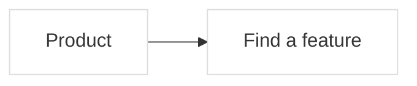

# Shape map contract

The product workspace is the default route. `?editor=1` opens the detailed
hierarchy editor. Both edit the same source and preserve the same feature IDs.

## Canonical metadata

The existing `mlc-format: 1` Mermaid subset remains supported. Shape map adds:



`%% sm-block: NODE_ID|JSON` stores optional `summary`, repository-relative `files`,
`status`, `review`, and `comments`. Status is `neutral`, `planned`, `verified`, or
`concern`. Comments include `id`, `body`, `kind` (`note`, `concern`, or `change`),
`author`, `createdAt`, and optional `resolved`. The service generates IDs and dates.

`%% sm-turn: JSON` is an immutable turn with `id`, consecutive `number`, `title`,
optional `summary`, `createdAt`, source `revision`, `nodes`, `categories`, and
optional map `settings`. Snapshots include review/comments without nested history.
Viewing a turn never restores it over the working graph.

## Derived colors

Red proposals take priority. An unresolved concern gives yellow. A verified state
requires a matching content fingerprint. Otherwise blue is a semantic change
between the last two completed turns, only while the live feature still matches
the last recorded turn. The first turn does not invent previous changes.

Fingerprints cover a feature's label, parent, task, proposal, workflow, description,
source paths, and immediate child IDs. Comments and review markers do not count
as implementation changes. A change to the feature invalidates its prior review.

## API and AI use

`GET /api/brief` returns `{text,mapPath,revision}`. `GET /api/repository` returns
real Git commits and the connected features inferred from their changed paths.
External map workspaces require `SHAPE_MAP_REPOSITORY_ROOT` to connect Git.

All semantic mutations use `POST /api/mutations` with `baseRevision`, `clientId`,
and one `operation`. Additions:

| Operation | Fields |
| --- | --- |
| `setBlock` | `id`, optional `label`, partial `block` (`summary`, `files`, `status`), optional `expectedFingerprint` |
| `addComment` | `id`, `body`, `kind`, `author` |
| `resolveComment` | `id`, `commentId`, optional `resolved` |
| `setProposal` | `id`, `proposal` or `null`, optional `expectedFingerprint` |
| `applyProposal` | `id` |
| `createTurn` | `title`, optional `summary` |

`addNode` accepts optional block metadata. `renameNode` supports the same optional
fingerprint guard. A stale same-feature form returns HTTP 409 `field_conflict`;
an old source revision returns HTTP 409 `revision_conflict`. Both include a fresh
snapshot. Overview label and block changes are atomic. Comments and proposals
remain intact when updating unrelated description fields.

Applying a proposal updates recorded task fields; it does not implement code.
An AI should inspect and change the actual repository, update the map to match
what was implemented, and record the reason. Human review belongs to the user.

CLI shortcuts:

```sh
npm run map -- brief
npm run map -- comment search "Consider finding by description" --kind change
npm run map -- propose search --reason "Names are too vague" --logic "Search names and descriptions"
npm run map -- turn "Search improvements" --summary "Explain the actual change and validation"
```

The server supplies turn IDs, comment IDs, dates, and review fingerprints. UI
operations cannot inject those values. Source editing remains an explicit
authoring channel; its declarations are descriptions, not verified runtime proof.

## Canvas and durability

`PUT /api/view` accepts `patch.shape` with positions, viewport, and fold state.
It is independent of legacy structure/workflow navigation and contains no semantic
data. Dragging a composition area repositions its child cards without reparenting.
Function hierarchy is deliberately progressive: enter a feature to see its parts.
Small screens use one column and readable initial zoom. Overview titles remain
readable while zoomed out.

Browser drafts store values, the editing base, and its fingerprint. External
changes merge into untouched fields. Conflicting edits preserve both versions
until the user chooses. Network or source errors retain the last valid graph.

Limits: 4,000 characters per text field, 100 source paths per block, 1,000 comments
per block, 100 turns, 1 MiB per turn, and 16 MiB per source. No model call, mail
delivery, telemetry, or hosted multi-user service is required to run the app.
