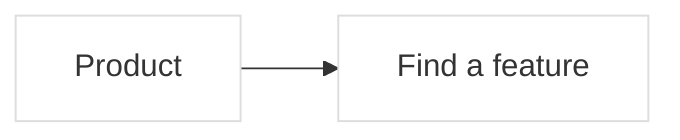

# Shape map contract

The product workspace is the default route. `?editor=1` opens the detailed
hierarchy editor. Both edit the same source and preserve the same feature IDs.

The whole-system view shows the main areas and their immediate internal cards,
folding deeper containers, with the main handoffs. Explicit
area relationships remain visible; **Detailed connections** exposes the smaller
data connections. Entering an area opens deeper nested cards. An explicit focus
link opens that area at a readable scale rather than restoring a different view's
saved camera. A link to the whole-system root restores its saved canvas state,
just like the home route. Reference notes remain in the source but are excluded from product
feature counts and color totals.

## Canonical metadata

The existing `mlc-format: 1` Mermaid subset remains supported. Shape map adds:



`%% sm-block: NODE_ID|JSON` stores optional `summary`, repository-relative `files`,
`status`, `review`, and `comments`. Status is `neutral`, `planned`, `verified`, or
`concern`. Comments include `id`, `body`, `kind` (`note`, `concern`, or `change`),
`author`, `createdAt`, and optional `resolved`. The service generates IDs and dates.

`%% sm-turn: JSON` is an immutable turn with `id`, consecutive `number`, `title`,
optional `summary`, `createdAt`, source `revision`, `nodes`, `categories`, and
optional map `settings`. Snapshots include review/comments without nested history.
Viewing a turn never restores it over the working graph.

`%% sm-link: JSON` records a cross-feature connection:

```json
{"id":"speech_to_render","source":"speech","target":"render","kind":"data","label":"Timed speech","condition":"When the user approves the selection"}
```

`id`, `source`, and `target` are stable identifiers; endpoints must exist and
must differ. `kind` is `flow`, `data`, `dependency`, or `activation`. `label` is
required (up to 180 characters); `condition` is optional (up to 4,000). Connection
cycles are allowed without changing the single-parent hierarchy. Up to 4,000
connections are supported. Optional `sourcePort` and `targetPort` are `left`,
`right`, `top`, or `bottom`; the canvas uses these saved endpoints when visible.
Duplicate IDs and unknown properties are rejected.

`%% sm-lens: JSON` defines a map-authored reading selector:

```json
{"id":"format","label":"Video format","options":[{"id":"spoken","label":"Spoken video","description":"Features used for speech-led editing","roots":["speech","render"],"exclude":[],"custom":["speech"],"pending":[]}]}
```

An optional lens `group` (up to 180 characters) groups related selectors in one
menu without changing their IDs, scope, or intersection semantics. No default
group is written for legacy maps.

An option includes all descendants of its `roots`, subtracts `exclude` branches,
and can mark `custom` branches as specific logic and `pending` branches as planned
or unconnected. Ancestor containers remain readable. Multiple selected lenses
intersect their scopes. Selectors highlight saved design; they never enable a
provider or change execution settings. The product contains no hardcoded video
formats or model names. Up to 20 lenses with 1–32 unique options each are allowed;
each ID list contains at most 2,000 existing features.

Turn snapshots also capture optional `links` and `lenses`. Deleting a subtree
prunes dangling endpoints and option references; hierarchy-editor undo restores
them along with the deleted cards.
Undo merges only references to restored cards and preserves newer unrelated
connections and reading-option text.

## Derived colors

Red proposals take priority. An unresolved concern gives yellow. A verified state
requires a matching content fingerprint. Otherwise blue is a semantic change
between the last two completed turns, only while the live feature still matches
the last recorded turn. The first turn does not invent previous changes.

Fingerprints cover a feature's label, parent, task, proposal, workflow, description,
source paths, immediate child IDs, and incident connections. Comments and review markers do not count
as implementation changes. A change to the feature invalidates its prior review.

## API and AI use

`GET /api/brief` returns `{text,mapPath,revision,targetCount,approved}`. Its optional
`?focus=NODE_ID` limits the brief to a feature and descendants. Global briefs
compare against the last recorded turn and include changed plans, new unresolved
notes, changed fields, and added IDs. A focused brief also includes that branch's
saved intent. The export references the canonical file instead of repeating tasks,
connections, and selectors. At most 12 targets and two memo excerpts per target
are expanded; remaining items stay in the source. Unknown IDs are rejected.

`POST /api/brief` adds optional `focus`, `problem`, `purpose`, `successCriteria`
(strings up to 4,000 characters each), and `approved` (boolean, default false).
Approval requires a nonempty problem and criteria. Human-written request fields
are exported in full. Generating a brief never mutates the map or calls a model.
It directs the agent to use **기획문답 / decision-interview**, clarify ambiguous
intent, agree on a final proposal, and implement after user approval. The portable
[facilitation skill](../skills/shape-map-facilitation/SKILL.md) describes this workflow.

Proposals support optional `purpose` and `successCriteria` alongside `reason`.
These planning fields remain separate from executable task fields; applying a
proposal does not put them into `task` or execute code.

`GET /api/repository` returns
real Git commits and the connected features inferred from their changed paths.
External map workspaces require `SHAPE_MAP_REPOSITORY_ROOT` to connect Git.

All semantic mutations use `POST /api/mutations` with `baseRevision`, `clientId`,
and one `operation`. Additions:

| Operation | Fields |
| --- | --- |
| `setBlock` | `id`, optional `label`, partial `block` (`summary`, `files`, `status`), optional `expectedFingerprint` |
| `addComment` | `id`, `body`, `kind`, `author` |
| `resolveComment` | `id`, `commentId`, optional `resolved` |
| `setProposal` | `id`, `proposal` or `null`, optional `expectedFingerprint` |
| `applyProposal` | `id` |
| `createTurn` | `title`, optional `summary` |
| `upsertLink` | `link` object |
| `removeLink` | connection `id` |
| `setMapLinks` | complete `links` array or `null` |
| `setMapLenses` | complete `lenses` array or `null` |

`addNode` accepts optional block metadata. `renameNode` supports the same optional
fingerprint guard. A stale same-feature form returns HTTP 409 `field_conflict`;
an old source revision returns HTTP 409 `revision_conflict`. Both include a fresh
snapshot. Overview label and block changes are atomic. Comments and proposals
remain intact when updating unrelated description fields.

Applying a proposal updates recorded task fields; it does not implement code.
An AI should inspect and change the actual repository, update the map to match
what was implemented, and record the reason. Human review belongs to the user.

CLI shortcuts:

```sh
npm run map -- brief
npm run map -- comment search "Consider finding by description" --kind change
npm run map -- propose search --reason "Names are too vague" --logic "Search names and descriptions"
npm run map -- turn "Search improvements" --summary "Explain the actual change and validation"
```

The server supplies turn IDs, comment IDs, dates, and review fingerprints. UI
operations cannot inject those values. Source editing remains an explicit
authoring channel; its declarations are descriptions, not verified runtime proof.

## Canvas and durability

`PUT /api/view` accepts `patch.shape` with positions, viewport, fold state, and
`layoutVersion: 3` for horizontal nested composition. Version 2 remains readable
for older clients. Upgrading resets outdated composition positions, viewport,
and folding, preserving legacy editor navigation and all source content.
It is independent of legacy structure/workflow navigation and contains no semantic
data. Dragging a composition area repositions its child cards without reparenting.
Composition and product views recursively pack cards in ordered horizontal grids.
Dense containers grow to hold their contents; rough branches keep smaller frames.
Sequences retain authored order. Deep branches never squeeze descendants narrower
with each level. The full label remains canonical and accessible; compact tiles
show the name before a descriptive separator when a label is long, with up to
two visible lines. Complete names and authored descriptions appear in the editor.
Card clicks expand or fold parts on the same canvas; leaf clicks select them.
The pencil opens attached details. Folding anchors the clicked card on screen
without changing zoom or fitting the whole diagram. Saved open sizes return on
expansion. Reparent drops preview the new parent and final pointer position
together, then install the saved source and view together. Canvas folds, depth
changes, movement, and resizing share the same undo/redo order as content edits.
Undoing a fold keeps its card anchored. Creating or pasting into a folded parent
records its automatic expansion with the content edit. Camera navigation and
unchanged view choices do not add history entries. Whole-card connection
targets prefer the deepest visible card; section background targets its section.
Four exact ports remain available. The target outline and committed connection
use the same targeting rule. The status text, minimap, and bottom controls each
reserve their own space. The separate focus button enters an area. Connections
between containers attach to their boundaries by default; the detailed-connections control exposes their
saved endpoints. Only an explicit sequence or recorded connection creates a
flow arrow. Function hierarchy is progressive: enter a feature to see its parts.
The diagram retains its horizontal composition on all screen sizes; compact
controls adapt to the available width without rearranging authored cards.
Composition cards do not create floating
title capsules on zoom out. The function hierarchy retains its overview labels.
The canvas can expand within the app for broad diagrams; the fit control includes
all cards, return routes, and labels.
Connection routing reserves parent title bands and handles unequal grid heights.
When a dense diagram has no clear space for an inline explanation, the complete
saved text remains on edge hover and in the connection inspector.

The pencil opens a nonmodal editor attached beside the card's screen position,
with a leader back to the selected card. Panning and zooming move the attachment
without resizing the canvas. The editor switches sides or uses a contained sheet
on small screens. Hidden descendants attach to their nearest visible ancestor.
Escape closes it and restores focus. Existing description, proposal, memo,
history, connection, local-draft, and conflict behavior remains shared. Its AI
action exports the selected feature's saved discussion; unsaved drafts stay local.

The whole-system projection initially folds deeper containers; entering an area
exposes more levels without limiting the source's hierarchy. The scope bar counts
product features and the selected area's descendants, excluding inherited
reference sections. Its whole-system action is available even on deep links.
The area reader shows authored natural-language descriptions, nested parts,
actual recorded turn changes, and saved proposals. It never synthesizes missing
architecture from the code or treats a proposal as completed implementation.
Feature history compares consecutive saved snapshots, independently of a red
proposal or review color, with before/after fields and connection descriptions.
The first turn remains a baseline. Git history can be narrowed to the selected
feature and its descendants using their explicit source-file links; Git commits
are still distinct from map turns, installed runtime, and human acceptance.

Browser drafts store values, the editing base, and its fingerprint. External
changes merge into untouched fields. Conflicting edits preserve both versions
until the user chooses. Network or source errors retain the last valid graph.

Limits: 4,000 characters per text field, 100 source paths per block, 1,000 comments
per block, 100 turns, 1 MiB per turn, and 16 MiB per source. No model call, mail
delivery, telemetry, or hosted multi-user service is required to run the app.
